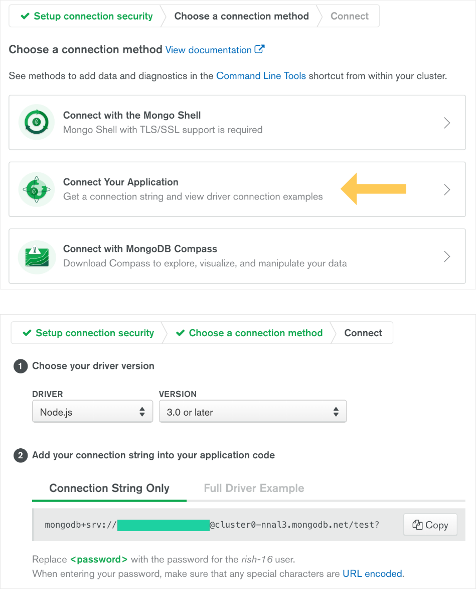
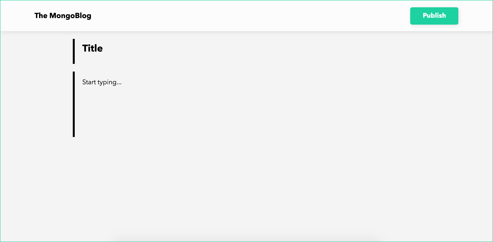

# NodeJS-MongoDB-Blog-Template

A complete API for blog posts using a MongoDB AWS backend

---

### Downloading the template

```bash
git clone https://github.com/rish-16/NodeJS-MongoDB-Blog
cd NodeJS-MongoDB-Blog
```

### Connecting to MongoDB

Visit the [MongoDB](https://cloud.mongodb.com/) website and sign up for an account. It should take you to your dashboard where it will prompt you to set up your cluster. Select **AWS** for the provider and follow the steps.

When you are the **Connect** step, you should see something like this:
<br>

Click the **Connect Your Application** button and it should take you to a popup with your **Connection String**. Copy this string.

Go back to the your text editor and create a file called `.env`. Create a variable for your connection string like so:

```
MONGO_CONNECT = "<INSERT_CONNECTION_STRING>"
```

_**Note:** Ensure your connection string has your username and password that match the credentials of the user you created on the MongoDB admin dashboard. If it doesn't match, you cannot access the cluster._

---

### Running the web app

To run the web app, you need to start a `localhost` server running on port 5000 (as found in `app.js`). To start the server, enter the following into your command line:

```bash
npm start
```

As written in the `package.json` file, it should run the command, `nodemon app.js` behind the scenes.

---

### Accessing the web app

To access the app, open up your browser and enter the following link:

```
http://localhost:5000/home
```

Since there are no posts created, it should open up a blank document that looks like this:


To create a post, click the new button at the top left hand corner of the screen. It will redirect you to the post creation page:



Type in a title and description and click **Publish**. It should redirect you to the home page and you should see your post there:


**Delete** deletes the post from the MongoDB cluster collection.
On clicking the title, it redirects you to a page with the JSON information about the post.

---

### Contributions

If interested in adding on to the project, feel free to open a pull request! Things on the roadmap:

1. Ability to add and delete comments on a post
2. Responsive UI redesign
3. Adding authentication and users

---

### License

MIT
